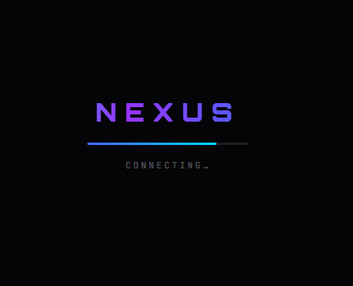

# 🔗 NEXUS

---

## 🌐 Site!

[Nexus](https://cameroncodesstuff.github.io/nexus/) - The messaging site made for students! (Soon being replaced by Pulse!)

---

---

## 🖥️ Tech Stack

- **Frontend:** HTML5, CSS3 (CSS Grid, Flexbox, custom scrollbars, mobile overlay), Vanilla JS (ES Modules)

- **Backend & Realtime:** Firebase Auth, Firestore (live listeners for messages, users, calls, invites)

- **Real-time Communication:** WebRTC (`RTCPeerConnection`) with STUN/TURN servers — audio, video, and screen sharing

- **Hosting / Assets:** GitHub Pages, GitHub API (for changelog fetching), Font Awesome

---

---

